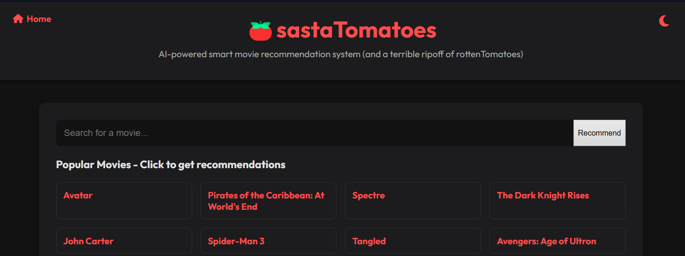
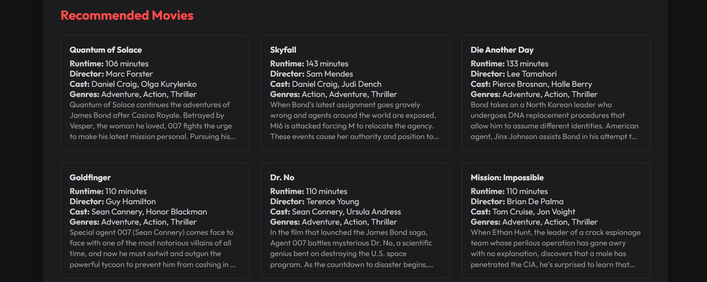
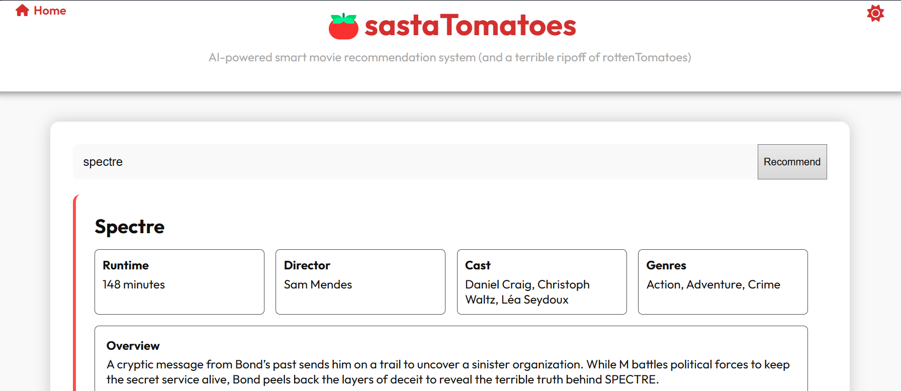

# 🍅 sastaTomatoes

### Your Smart AI-Powered Movie Recommender (totally not a ripoff of RottenTomatoes )
Built using Python (with Flask), pandas, and NLP-based similarity metrics, `sastaTomatoes` helps you discover movies similar to your favorites with content-based filtering.


## Tech Stack

| Layer       | Tools Used                            |
|-------------|----------------------------------------|
| Frontend    | Javascript, HTML/CSS  |
| Backend     | Python, Pandas, Scikit-learn, FuzzyWuzzy |
| Recommender | TF-IDF + Cosine Similarity |
| Data Source | TMDb 5000 Movies + Credits CSV         |


## Features

- Detailed movie viewer (cast, genre, director, runtime, overview)

- Theme toggle (dark / light)

- Responsive design and tile layout for movie cards

- Smart fuzzy search with autocomplete

- Detailed recommendations per query 


## Recommendation Logic

- Combines **overview**, **genre**, **keywords**, **cast**, and **director** into tags

- TF-IDF vectorization over these tags

- Computes cosine similarity between all movie vectors

- Returns the top 10 most similar titles (excluding input)
  


## Screenshots 

### Search Page


### Recommendation Results


### Light Mode



## Installation

Follow these steps to set up the project locally:

- **Clone the repository**
  ```bash
  git clone https://github.com/Tornado025/sastaTomatoes.git
  cd sastaTomatoes

- **Install dependencies**
  ```bash
  pip install pandas scikit-learn fuzzywuzzy python-Levenshtein flask flask-cors

- **Run the Flask App**
  ```bash
  python app.py

- **Access it in your browser**
  ```bash
  https://localhost:5000
## License 

This project is licensed under the MIT License. See the LICENSE file for details.
